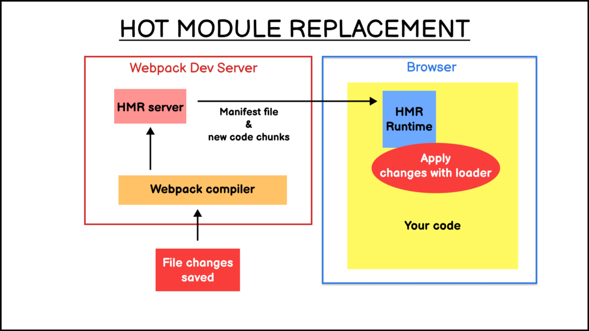

# Webpack Basics

## Installation and Initialization

```bash
cd myProject
npm init -y
npm install webpack webpack-cli --save-dev
```

create a `webpack.config.js` file and specify the entry, output and mode.

```js
"use strict";
const path = require("path");
module.exports = {
  entry: "./src/index.js",
  output: {
    path: path.join(__dirname, "dist"),
    filename: "bundle.js",
  },
  mode: "production",
};
```

add a script to `scirpts` field in `package.json`

```json
{
  "scripts": {
    "build": "webpack"
  }
}
```

## Basic Concepts and Configuration

### 1. Entry and Context

Entry is a **entry point** indicating which module should used to begin building out its dependency graph.

1. Single Entry [string]

```js
module.exports = {
  entry: "./src/index.js",
};
```

2. Multiple Entries [object]

```js
module.exports = {
  entry: {
    app: "./src/app.js",
    search: "./src/search.js",
  },
};
```

Context is an **absolute path** referring to the base directory for resolving entry points and loaders from configuration. By default the current directory is used.

```js
module.exports = {
  context: path.resolve(__dirname, "app"),
};
```

### 2. Output

Tell webpack how to write complied files to disk.

```js
module.exports = {
  output: {
    path: path.resolve(__dirname, "dist"),
    filename: "[name].js", // [name] is a placeholder indicate the key in entry config
  },
};
```

> #### Template Strings

> |   Template    |                            Description                             |
> | :-----------: | :----------------------------------------------------------------: |
> |  [fullhash]   |                    The full hash of compilation                    |
> | [contenthash] | The hash of the chunk, including only element of this content type |
> |  [chunkhash]  |     The hash of the chunk, including all elements of the chunk     |
> |     [ext]     |                           The extension                            |
>
> **Note**: [hash:16] to specify the length of hashes(defaults to 20)

### 3. Loaders

Loaders are **transformations** that applied to the source code of a module. They allow you to preprocess files as you `imoprt` them.

```bash
npm i --save-dev css-loader ts-loader
```

```js
module.exports = {
  module: {
    rules: [
      { test: /\.css$/, use: "css-loader" },
      { test: /\.ts$/, use: "ts-loader" },
    ],
  },
};
```

Examples

> #### 1. transform ES6 and JSX --- use babel-loader

> ##### ES6
>
> ```bash
> npm i @babel/core @babel/preset-env babel-loader -D
> ```
>
> **.babelrc**
>
> ```json
> {
>   "presets": ["@babel/preset-env"]
> }
> ```
>
> `package.json`
>
> ```js
> module.exports = {
>   module: {
>     rules: [{ test: /\.js/, use: "babel-loader" }],
>   },
> };
> ```
>
> ##### React
>
> ```bash
> npm i react react-dom
> npm i @babel/preset-react -D
> ```
>
> **.babelrc**
>
> ```json
> { "presets": ["@babel/preset-react"] }
> ```
>
> #### 2. CSS and SASS

> ##### CSS

> `css-loader`: interprets `@import` and `url()` like `import/require()`, and resolves them.
> `style-loader`: inject CSS into the DOM.

> ##### SASS
>
> ```bash
> npm i sass sass-loader -D
> ```
>
> `sass-loader`: load a SASS/SCSS file and compile it.
> _webpack.config.js_
>
> ```js
> module.exports = {
>   module: {
>     rules: [
>       {
>         test: /\.s[ac]ss/i,
>         use: ["style-loader", "css-loader", "sass-loader"],
>       },
>     ],
>   },
> };
> ```
>
> #### 3. Images and Fonts

> _Prior webpack5_ is was common to use:
> `raw-loader`: import files as string.
> `url-loader`: import files as base64 data URI(uniform resource identifier).(This loader has all functions that `file-loader` has).
> `file-loader`: resolve `import/require()` on a file into a URL(uniform resource locator) and emit a file in the output directory.
> **webpack.config.js**
>
> ```js
> module.exports = {
>   modules: {
>     rules: [
>       {
>         test: /\.(png|jpe?g|gif)$/i,
>         use: "file-loader",
>         options: {
>           name: "[name].[contenthash].[ext]",
>           outputPath: "images",
>         },
>       },
>     ],
>   },
> };
> ```
>
> _In Webpack5_ there are 4 new module types
> `asset/resource`: => `file-loader`,
> `asset/inline`: => `url-loader`,
> `asset/source`: => `raw-loader`,
> `asset`: automatically chooses between exporting a data URI and emitting a seperate file(default `8kb`). Previously achieved by using `url-loader` with _asset size limit_.
> **webpack.config.js**
>
> ```js
> module.exports = {
>   output: {
>     path: path.resolve(__dirname, "dist"),
>     filename: "[name].[contenthash:8].js",
>     assetModuleFilename: "images/[name].[contenthash:8].[ext]",
>   },
>   modules: {
>     rules: [
>       {
>         test: /\.(png|jpe?g|gif)$/,
>         type: "asset/resource",
>         parser: {
>           dataUrlCondition: {
>             maxSize: 4 * 1024, // 4kb
>           },
>         },
>       },
>     ],
>   },
> };
> ```

### 4. Plugins

The backbone of Webpack.
**Anatomy**: A webpack plugin is a js `object` with an `apply` method. This method is called by the webpack compiler, giving access to the _entire_ compilation lifecycle.

```js
module.exports = {
  plugins: [new HtmlWebpackPlugin({ template: "./src/index.html" })],
};
```

#### Examples

> ##### 1. Hot Module Replacement

> exchanges, adds or removes modules while an application is running without a full reload.
>
> - retain application state.
> - speed up by only updating what's changed.
>
> ```js
> const webpack = require("webpack");
> module.exports = {
>   plugins: [new webpack.HotModuleReplacementPlugin()],
> };
> ```
>
> 
> Reference: [webpack official](https://webpack.js.org/concepts/hot-module-replacement/)

> ##### 2. MiniCssExtractPlugin

> This plugin extrats CSS into seperate files. _This is not compatible with `style-loader`_.
>
> ```bash
> npm install --save-dev mini-css-extract-plugin
> ```
>
> **webpack.config.js**
>
> ```js
> module.exports = {
>   plugins: [new MiniCssExtractPlugin({ filename: '[name].[contenthash:8].css' })],
>   module: {
>     rules: [
>       test: /\.css$/i,
>       use: [MiniCssExtractPlugin.loader, 'css-loader'],
>     ]
>   }
> }
> ```

### 5. Mode

1. `'development'`: set `process.env.NODE_ENV` on `DefinePlugin` to value `'development'`
2. `'production'`
3. `'none'`
   _note_: `DefinePlugin` allows you to create global constants which can be configured in compile time.

### 6. Watch and WatchOptions

_Tip_: in `webpack-dev-server` and `webpack-dev-middleware` is enabled by default.

```js
module.exports = {
  watch: true,
  watchOptions: {
    // files that are not required to watch
    ignored: /node_modules/,
    // when watched files change, delay recomplilation for 300ms
    aggregateTimeout: 300,
    // how many times of checking for update per second
    poll: 1000,
  },
};
```

### 7. DevServer

```bash
npm i webpack-dev-server -D
```

**webpack.config.js**

```js
module.exports = {
  devServer: {
    contentBase: path.resolve(__dirname, "dist"),
    compress: true,
    port: 9000,
    hot: true, // cooperate with webpack.HotModuleReplacementPlugin
  },
};
```

### 8. The Manifest

In typicall application building with webpack, there three major codes:

1. The source code you write.
2. "Vendor" code your source code dependt on.
3. Webpack runtime and **manifest** that conducts the interaction of all modules.
